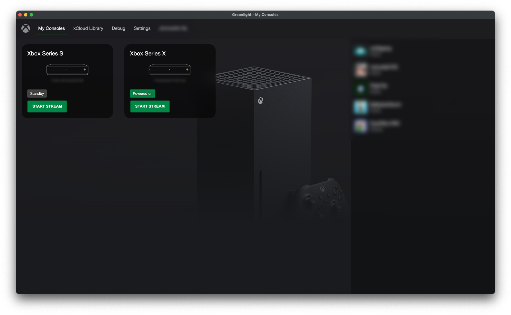
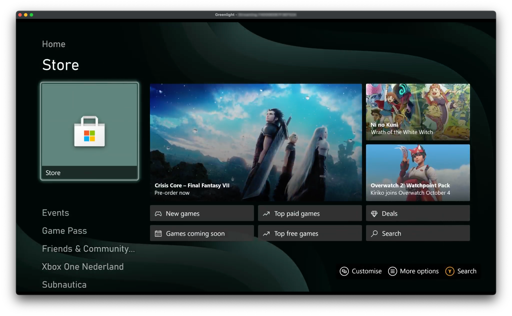

# LuzVerdeWeb

[](https://github.com/unknownskl/greenlight/actions/workflows/build_desktop.yml)

LuzVerdeWeb é uma aplicação web open-source para streaming de Xbox e xCloud, desenvolvida em Javascript e Typescript. Esta é a versão web do cliente Greenlight desktop.

**AVISO: LuzVerdeWeb não é afiliada com Microsoft, Xbox ou Moonlight. Todos os direitos e marcas registradas são propriedade de seus respectivos donos.**

## Funcionalidades

- Stream de vídeo e áudio do Xbox One e Xbox Series
- Suporte para controles de gamepad
- Suporte a rumble no xCloud
- Controles via teclado
- Lista de amigos online integrada

 

## Requisitos

- NodeJS ([https://nodejs.org/](https://nodejs.org/))
- Yarn ([https://yarnpkg.com/](https://yarnpkg.com/))

## Passo a Passo para Reproduzir o Repositório

### 1. Clonar o repositório

```bash
git clone https://github.com/unknownskl/greenlight.git
cd greenlight
```

### 2. Instalar as dependências

Instale todas as dependências do projeto usando Yarn:

```bash
yarn
```

Este comando instalará as dependências de todos os pacotes no repositório (monorepo).

### 3. Rodando a versão Web

Para rodar a aplicação web em modo de desenvolvimento:

```bash
cd packages/web
yarn dev
```

A aplicação estará disponível em `http://localhost:3000`

### 4. Build de Produção

Para criar um build de produção da aplicação web:

```bash
cd packages/web
yarn build
yarn start
```

## Controles de Teclado

As teclas são mapeadas da seguinte forma por padrão:

- **Dpad**: Controles de direção do teclado numérico
- **Botões**: A, B, X, Y, Backspace (Mapeado como B), Enter (Mapeado como A)
- **Nexus (Botão Xbox)**: N
- **Botão Esquerdo**: [
- **Botão Direito**: ]
- **Gatilho Esquerdo**: -
- **Gatilho Direito**: =
- **View**: V
- **Menu**: M

## Estatísticas de Streaming

Durante o stream, você pode mostrar estatísticas de debug que contêm dados extras sobre as filas de buffer e outras informações. Para trazer isso, pressione `~` no seu teclado.

No canto inferior esquerdo você pode ver o status (embora nem sempre seja preciso). No canto superior direito você pode encontrar o FPS dos decodificadores de vídeo e áudio, incluindo a latência. No canto inferior direito você pode encontrar informações de depuração sobre as filas de buffer e outras informações úteis para depuração.

Quando possível, sempre forneça essas informações com seu problema, se for relacionado.

## Lista de Amigos Online

A aplicação também fornece uma maneira de ver quais de seus amigos estão online. Isso pode ser útil quando você quer verificar rapidamente se alguém está online para jogar :)

## Configuração para Steam Deck

Esta aplicação funciona no Steam Deck com alguns pequenos bugs e efeitos colaterais. Você pode mapear um dos botões traseiros do Steam Deck para a tecla 'N' para simular o botão Xbox.

## Como Fechar a Aplicação

Clique no logo do Xbox no canto superior esquerdo. Ele pedirá para você confirmar o fechamento da janela.

## Changelog

Veja [changelog](https://unknownskl.github.io/greenlight/docs/desktop/changelog).

## Traduções

Quer ajudar com novas traduções? Ajude-nos em [Poeditor.com](https://poeditor.com/join/project/9SfHRQDbfN)

## Licença

Este projeto é open-source e está disponível sob a mesma licença do projeto Greenlight original.
